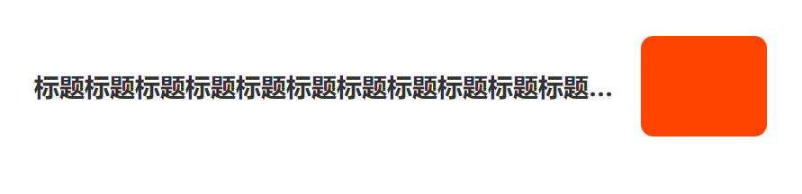

1.  flex 布局后 文字超出省略... 失去效果

flex 布局后 一边固定 width 一边自动 width 自动宽如果在使用文字超出省略... 回失去效果  

需要给自动宽box设置 `whith:0px`



```html
<!DOCTYPE html>
<html lang="en">
  <head>
    <meta charset="UTF-8" />
    <meta http-equiv="X-UA-Compatible" content="IE=edge" />
    <meta name="viewport" content="width=device-width, initial-scale=1.0" />
    <title>Document</title>
    <style>
      .knowledge-item {
        display: flex;
        justify-content: space-between;
        align-items: center;
        padding: 16px;
        overflow: hidden;
        box-sizing: border-box;
      }
      .left {
        flex: 1;
        text-align: left;
        margin-right: 10px;
        position: relative;
        /* 这一步很关键如果没有这个 ...失效 */
        width: 0;  
      }
      .context h1 {
        font-size: 16px;
        font-weight: 600;
        color: #323233;
        line-height: 24px;
        white-space: nowrap;
        text-overflow: ellipsis;
        overflow: hidden;
      }
      .right {
        width: 80px;
        height: 64px;
        border-radius: 8px;
        background-color: #f40;
      }
    </style>
  </head>
  <body>
    <div class="knowledge-item">
      <div class="left">
        <div class="context">
          <h1>
            标题标题标题标题标题标题标题标题标题标题标题标题标题标题标题标题标题标题标题标题
          </h1>
        </div>
      </div>
      <div class="right"></div>
    </div>
  </body>
</html>
```

