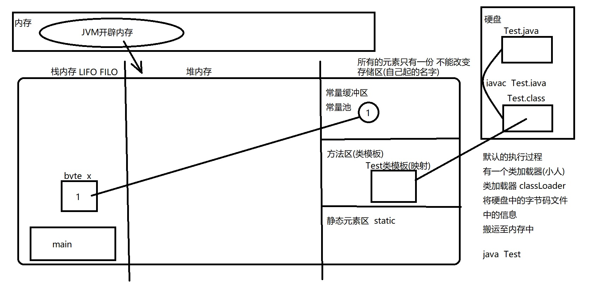

[TOC]


# java语言基本结构

## 基本数据类型

1. 基本数据类型 （8个）

   - 4 整型 (byte short int long)
     
     > byte (8bit) 1字节
     >
     >  byte 字节型 ====> 8bit 
     >
     > 1字节 == 8bit 0 0000000 2的8次方 = 256 种组合
     >
     > 用第一个 bit来记录符号  0正数 1负数 	所以 byte 类型的的数值范围是 ` -2的7次方  到 2的7次方减一 `（-128 ~ 127）（减一是是因为0不存在正负一说）
     
     ​	
     
     > short (16bit) 2字节
     >
     > ` -2的16次方  到 2的16次方减一 `（-32768 ~ 32767）
     
     > int (32bit) 4字节
     >
     > ` -2的32次方  到 2的32次方减一 `（-2147483648 ~ 2147483648）
     
     > long (64 bit) 8字节
     >
     > ` -2的64次方  到 2的64次方减一 `（-18,446,744,073,709,551,616 ~ 18,446,744,073,709,551,615）
     
   - 2 浮点（float double）

        整数行 没有负数

        > float （32bit） 4字节
        > 根据IEEE754标准，浮点数float，符号位占1bit，指数占8bit，有效位占23bit，所以范围表示为3.4E-38~3.4E38，比long的范围大。
        >
        > 0 00000000 00000000000000000000000
        >
        > 第一位还是用语`符号位` 第二位到第九位是`指数位` 后面的`底数位`

        > double （64bit） 8字节
        >
        > 0 00000000000 00000000000000000000000...
        >
        > 第一位还是用语`符号位` 第二位到第十二位是`指数位` 后面的`底数位`

   - 1 字符 （char）

        > char （16bit） 2字节  unicode 编码

   - 1 布尔 （boolean）

        > boolean (1bit)  1/8字节 

3. 引用类型（没有个数 因为可以自定义 下面几个常用的）
    - 数组[]
    - 类class (抽象类abstract class)
    - 接口 interface
    - 枚举 enum
    - 注解 @interface
    
    ------
    
    

## 常量与变量

1. 常量

   定义 : **常量指的是在程序运行中`不能再次改变`的值**

   作用：

    - 固定的值 便于程序计算 （例如3.1415926...）
    -  用来代表一个含义 （例如：用up 代表上 down 代表下）

   什么样的值算常量？

   	-  固定不变的值 （可以认为所有基本类型的值 固定不变的 是常量）
   	-  特殊的常量 (String) （String是一个引用类型 `他的值` 比较特殊可以用作常量）
   	-  自己创建的空间，存储的一个值，让他固定起来，不可改变

2. 变量

   定义：**变量指的是程序`执行中可以改变`的 **
   
   ​	变量是一个内存空间（小容器）
   
   ​	变量空间在创建（声明）的时候，必须指定数据类型 和 变量空间名称
   
   ​	变量空间里面只能存储一个内容（值 | 引用）
   
   ​	变量空间的内容可以改变
   
   命名规则：
   
   ​	字母（区分大小写）、数字（数值是**不允许开头**） 、符号（不建议用_或者$ 开头） 、中文（不推荐）
   
   命名规约：一切要为了增强程序的可读性
   
   ​	类名字：最好使用大驼峰
   
   ​	变量名：最好使用小驼峰
   
   变量名创建/声明：
   
   ​	`数据类型 变量名称`
   
   ​	`int a`
   
   ​	`String b` 
   
   注意事项：
   
   ​	变量是一个空间 可以只创建空间 里面不存值 变量空间创建后里面是没有默认内容的 但是空的空间变量不能拿来使用 会编译错误
   
   ​	byte x;//声明一个空间说明 空间变量的名字是x 要求空间变量里面存储的类型是byte整型
   
   ​	x=1;// 将一个1赋值的x的空间内进行存储
   
   上面这两部操作 对于计算机底层是怎么做的 看下图
   
   > x是什么?   变量空间   存在哪儿?----栈内存里
   >
   > 1是什么?   1是常量    存在哪儿?----常量缓冲区
   >
   > =是什么?  =是赋值    做了什么?
   
   ```java
   //1.硬盘上创建了一个文件    Test.java
   //2.文件中的内容是我们编写的源代码(跟计算机发送指令)
   public class Test{
   	public class Test{
   		public static void main(String[] args){
   				byte x;
   				x = 1;
   			}
   	}
   //3.将Test.java源文件---->编译---->Test.class
   //			内容  我们看不懂  字节码 留给计算机识别
   //4.执行---->内存中执行
   //			将硬盘上的Test.class内容  加载  到内存里
   //5.我们写好的指令  执行内存的空间  赋值  变化。。。。看下图
   ```
   
   
   
   ​	
   
   ------
   
   给变量赋值数字  **整数默认是int** **小数默认是double** 所以下面要加字母来告知
   
   float e = 3.4F;
   		从double转化到float会有损失
   		1  3.4  常量值
   		存储在常量缓冲区中的
   		常量值的存储形式肯定不是十进制   是以二进制形式存储
   		1---->  32bit(int)
   		3.4-->  64bit(double)

   byte a = 1;
   		1--->32bit  
   		00000000 00000000 00000000 00000001
   		a--->8bit
   		00000001
   		=赋值的时候做了一个自动的决定   自动类型转化
   	
   long d = 2147483648L;
   		-2147483648    2147483647是int类型的取值范围
   		如果创建的常量值超过以上范围
   		程序编译检测的时候会认为  数字太大
   		如果我们真的需要那么大的数字  必须在后面加L告知

​		

| 字符          | 字符串                                     |
| ------------- | ------------------------------------------ |
| char          | String                                     |
| 基本类型      | 引用类型                                   |
| ‘a’（单引号） | "a"     "abc"      ""      null （双引号） |


## 类型转化问题

​	

​	基本类型

​		整型 浮点 字符 布尔

​	引用类型


1. 同种数据类型之间是可以直接进行赋值操作

2. 数据类型不同的空间 之间发生转换

   ​	同种大的类型之间才能发生转换

   ​		基本类型 ---- 基本类型  可以直接转换（自动 强制）

   ​		引用类型 ---- 引用类型  可以直接转换 （自动 强制 -- 上转型 下转型）

   ​		基本类型 ---- 引用类型  不可以直接转换 （间接 -- 包装类/封装类） 

3. 保证大数据类型一致的前提下

   1. 小数据类型相同 （都是整型 或者 都是浮点）

      ​	大空间变量**可以**直接存储小空间的数据

      ​	小空间变量**不可以**直接存储大空间的数据`（需要强制转换）` 如果在转换过程中数值范围超过边界 **可能会有损失数据**

      ```java
      	byte a = 1; int b = a //自动转换
        int a = 2 byte b =(byte)a; //强制转换 把a强制转换成byte类型
      	float x = 3.4F;   double y = x;//自动直接转化
      	double x = 3.4; float y = (float)x;//强制转换
      	//如果发现强制转换之前的数值比较大 强制转化这件事情是可以 但是 里面值会改变
      	int a = 1000; byte b = (byte)a;//编译好用 执行后 b存放的值一定发生变化
      ```

   2. 小数据类型不同

      整型 --- 浮点型

      ​	两边类型比较精确程度，浮点型精确程度更高，可以直接存放整数，反正则需要强制转换，任何一个浮点型都可以存放一个整型

      ```java
      int a = 1;  float b = a;//自动直接转化
      float a =1.0F;  int b = (int)a;//强制类型转换
      ```

      整型 --- 字符串

      ​	每一个字符都对应这一个Unicode码   a--97

      ```java
      char x = 'a';  int y = x;//自动转化  y--97
      int x = 97; char y = (char)x;//强制的转化
      ```

      布尔类型很特殊
      	不能与其他基本类型之间发生转化

