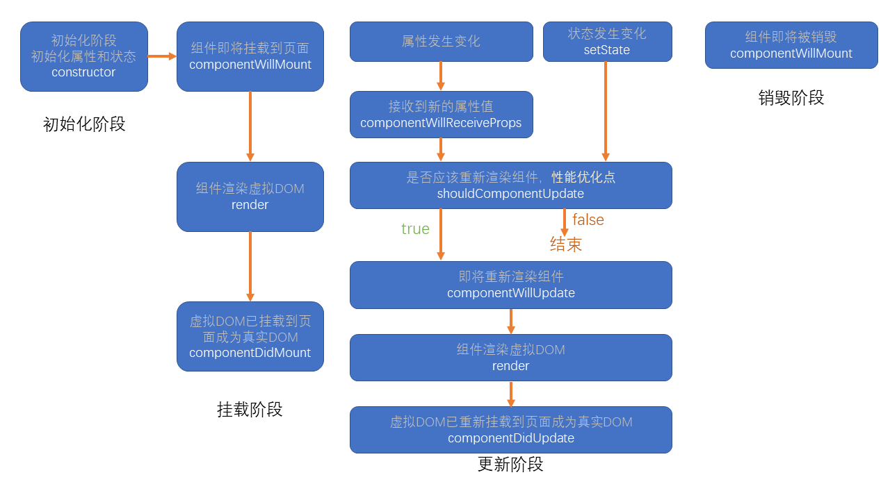
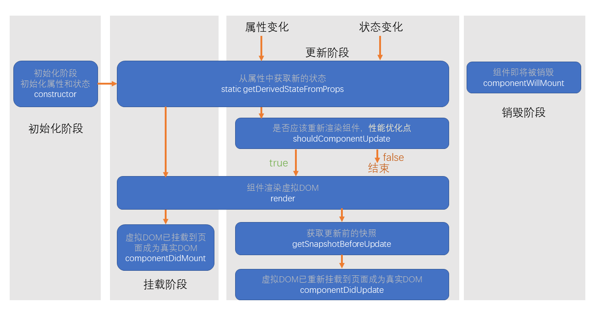

#

[toc]

# JSX

## 什么是 JSX

- Facebook 起草的 JS 扩展语法
- 本质是一个 JS 对象，会被 babel 编译，最终会被转换为 React.createElement
- 每个 JSX 表达式，有且仅有一个根节点
  - React.Fragment
- 每个 JSX 元素必须结束（XML 规范）

## 在 JSX 中嵌入表达式

- 在 JSX 中使用注释
- 将表达式作为内容的一部分
  - null、undefined、false 不会显示
  - 普通对象，不可以作为子元素
  - 可以放置 React 元素对象
- 将表达式作为元素属性
- 属性使用小驼峰命名法
- 防止注入攻击
  - 自动编码
  - dangerouslySetInnerHTML

## 元素的不可变性

- 虽然 JSX 元素是一个对象，但是该对象中的所有属性不可更改
- 如果确实需要更改元素的属性，需要重新创建 JSX 元素

# 组件和组件属性

组件：包含内容、样式和功能的 UI 单元

## 创建一个组件

**特别注意：组件的名称首字母必须大写**

1. 函数组件

返回一个 React 元素

2. 类组件

必须继承 React.Component

必须提供 render 函数，用于渲染组件

## 组件的属性

1. 对于函数组件，属性会作为一个对象的属性，传递给函数的参数

   ```javascript
   import React from "react";

   export default function MyFuncComp(props) {
     // return <h1>函数组件的内容</h1>
     return <h1>函数组件，目前的数字：{props.number}</h1>;
   }
   ```

2. 对于类组件，属性会作为一个对象的属性，传递给构造函数的参数

   ```javascript
   import React from "react";

   export default class MyClassComp extends React.Component {
     // constructor(props) {
     //     super(props); // this.props = props;
     //     console.log(props, this.props, props === this.props);
     // }

     /**
      * 该方法必须返回React元素
      */
     render() {
       if (this.props.obj) {
         return (
           <>
             <p>姓名：{this.props.obj.name}</p>
             <p>年龄：{this.props.obj.age}</p>
           </>
         );
       } else if (this.props.ui) {
         return (
           <div>
             <h1>下面是传入的内容</h1>
             {this.props.ui}
           </div>
         );
       }
       return <h1>类组件的内容，数字：{this.props.number}</h1>;
     }
   }
   ```

注意：**组件的属性，应该使用小驼峰命名法**

**组件无法改变自身的属性**。

之前学习的 React 元素，本质上，就是一个组件（内置组件）

React 中的哲学：数据属于谁，谁才有权力改动

**React 中的数据，自顶而下流动**

# 组件状态

组件状态：组件可以自行维护的数据

**组件状态仅在类组件中有效**

状态（state），本质上是类组件的一个属性，是一个对象

**状态初始化**

**状态的变化**

不能直接改变状态：因为 React 无法监控到状态发生了变化

必须使用 this.setState({})改变状态

一旦调用了 this.setState，会导致当前组件重新渲染

**组件中的数据**

1. props：该数据是由组件的使用者传递的数据，所有权不属于组件自身，因此组件无法改变该数组
2. state：该数组是由组件自身创建的，所有权属于组件自身，因此组件有权改变该数据

# 事件

在 React 中，组件的事件，本质上就是一个属性

按照之前 React 对组件的约定，由于事件本质上是一个属性，因此也需要使用小驼峰命名法

**如果没有特殊处理，在事件处理函数中，this 指向 undefined**

1. 使用 bind 函数，绑定 this
2. 使用箭头函数

```javascript
import React, { Component } from "react";
export default class Test extends Component {
  // handleClick不在原型上，而在实例对象上
  test1 = () => {
    console.log(this);
    console.log("点击了1");
  };
  // handleOver在原型上，不在实例对象上
  test2() {
    console.log(this);
    console.log("点击了2");
  }
  test3() {
    console.log(this); //undefiend
    console.log("点击了3");
  }
  render() {
    return (
      <>
        {/* 利用箭头函数 实现this绑定 */}
        <div onClick={this.test1}>1</div>
        <div onClick={() => this.test2()}>1.1</div>
        {/* 利用bind 绑定this */}
        <div onClick={this.test2.bind(this)}>2</div>
        {/* 这种 test3 里面得this是undefiend */}
        <div onClick={this.test3}>3</div>
      </>
    );
  }
}
```

# 深入认识 setState

setState，它对状态的改变，**可能**是**异步**的

> 如果改变状态的代码处于某个 HTML 元素的事件中，则其是异步的，否则是同步

如果遇到某个事件中，需要同步调用多次，需要使用函数的方式得到最新状态

最佳实践：

1. 把所有的 setState 当作是异步的
2. 永远不要信任 setState 调用之后的状态
3. 如果要使用改变之后的状态，需要使用回调函数（setState 的第二个参数）
4. 如果新的状态要根据之前的状态进行运算，使用函数的方式改变状态（setState 的第一个函数）

```javascript
this.setState(
  (cur) => {
    //参数cur表示当前的状态
    //该函数的返回结果，会混合（覆盖）掉之前的状态
    //该函数是异步执行
    return {
      n: cur.n + 1,
    };
  },
  () => {
    //所有状态全部更新完成，并且重新渲染后执行该函数
    console.log("state更新完成", this.state.n);
  }
);
```

React 会对异步的 setState 进行优化，将多次 setState 进行合并（将多次状态改变完成后，再统一对 state 进行改变，然后触发 render）

# 生命周期

生命周期：组件从诞生到销毁会经历一系列的过程，该过程就叫做生命周期。React 在组件的生命周期中提供了一系列的钩子函数（类似于事件），可以让开发者在函数中注入代码，这些代码会在适当的时候运行。

**生命周期仅存在于类组件中，函数组件每次调用都是重新运行函数，旧的组件即刻被销毁**

## 旧版生命周期

React < 16.0.0



1. constructor
   1. 同一个组件对象只会创建一次
   2. 不能在第一次挂载到页面之前，调用 setState，为了避免问题，构造函数中严禁使用 setState
2. componentWillMount
   1. 正常情况下，和构造函数一样，它只会运行一次
   2. 可以使用 setState，但是为了避免 bug，不允许使用，因为在某些特殊情况下，该函数可能被调用多次
3. **render**
   1. 返回一个虚拟 DOM，会被挂载到虚拟 DOM 树中，最终渲染到页面的真实 DOM 中
   2. render 可能不只运行一次，只要需要重新渲染，就会重新运行
   3. 严禁使用 setState，因为可能会导致无限递归渲染
4. **componentDidMount**
   1. 只会执行一次
   2. 可以使用 setState
   3. 通常情况下，会将网络请求、启动计时器等一开始需要的操作，书写到该函数中
5. 组件进入活跃状态
6. componentWillReceiveProps
   1. 即将接收新的属性值
   2. 参数为新的属性对象
   3. 该函数可能会导致一些 bug，所以不推荐使用
7. **shouldComponentUpdate**
   1. 指示 React 是否要重新渲染该组件，通过返回 true 和 false 来指定
   2. 默认情况下，会直接返回 true
8. componentWillUpdate
   1. 组件即将被重新渲染
9. componentDidUpdate
   1. 往往在该函数中使用 dom 操作，改变元素
10. **componentWillUnmount**
    1. 通常在该函数中销毁一些组件依赖的资源，比如计时器

## 新版生命周期

React >= 16.0.0



React 官方认为，某个数据的来源必须是单一的

1. getDerivedStateFromProps
   1. 通过参数可以获取新的属性和状态
   2. 该函数是静态的
   3. 该函数的返回值会覆盖掉组件状态
   4. 该函数几乎是没有什么用
2. getSnapshotBeforeUpdate
   1. 真实的 DOM 构建完成，但还未实际渲染到页面中。
   2. 在该函数中，通常用于实现一些附加的 dom 操作
   3. 该函数的返回值，会作为 componentDidUpdate 的第三个参数

# 传递元素内容

内置组件：div、h1、p

```javascript
import React from "react";
import ReactDOM from "react-dom";
import Comp from "./Comp";

ReactDOM.render(
  <Comp content1={<h2>第2组元素内容</h2>} content2={<h2>第3组元素内容</h2>}>
    <h2>第1组元素内容</h2>
  </Comp>,
  document.getElementById("root")
);
```

```javascript
import React from "react";

export default function Comp(props) {
  console.log(props);
  return (
    <div className="comp">
      <h1>组件自身的内容</h1>
      {/* {props.children || <h1>默认值</h1>} */}
      {props.children}
      {props.content1}
      {props.content2}
    </div>
  );
}
```

如果给自定义组件传递元素内容，则 React 会将元素内容作为 children 属性传递过去。

# 表单

**受控组件和非受控组件**

受控组件：组件的使用者，有能力完全控制该组件的行为和内容。通常情况下，受控组件往往没有自身的状态，其内容完全收到属性的控制。

非受控组件：组件的使用者，没有能力控制该组件的行为和内容，组件的行为和内容完全自行控制。

**表单组件，默认情况下是非受控组件，一旦设置了表单组件的 value 属性，则其变为受控组件(单选和多选框需要设置 checked)**
