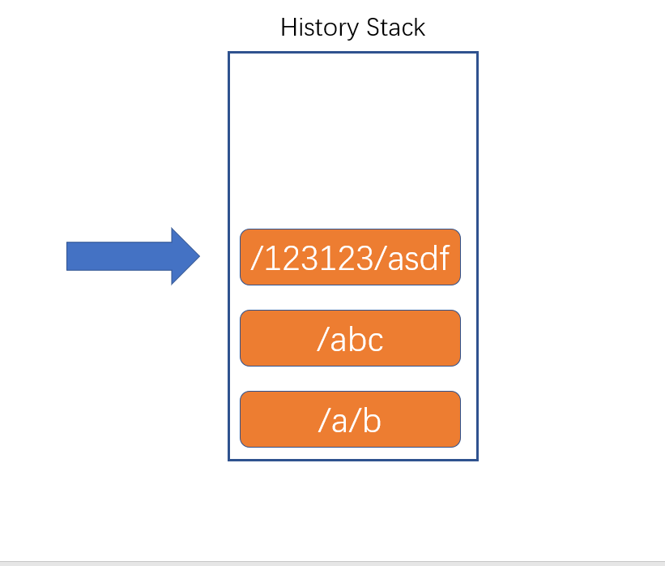

# React Router 概述

> 版本：React Router5

## 站点


无论是使用Vue，还是React，开发的单页应用程序，可能只是该站点的一部分（某一个功能块）

一个单页应用里，可能会划分为多个页面（几乎完全不同的页面效果）（组件）

如果要在单页应用中完成组件的切换，需要实现下面两个功能：

1. 根据不同的页面地址，展示不同的组件（核心）
2. 完成无刷新的地址切换

我们把实现了以上两个功能的插件，称之为路由

## React Router

1. react-router：路由核心库，包含诸多和路由功能相关的核心代码
2. react-router-dom：利用路由核心库，结合实际的页面，实现跟页面路由密切相关的功能

> 如果是在页面中实现路由，需要安装react-router-dom库


# 两种模式

路由：根据不同的页面地址，展示不同的组件

url地址组成

例：https://www.react.com:443/news/1-2-1.html?a=1&b=2#abcdefg

1. 协议名(schema)：https
2. 主机名(host)：www.react.com
   1. ip地址
   2. 预设值：localhost
   3. 域名
   4. 局域网中电脑名称
3. 端口号(port)：443
   1. 如果协议是http，端口号是80，则可以省略端口号
   2. 如果协议是https，端口号是443，则可以省略端口号
4. 路径(path)：/news/1-2-1.html
5. 地址参数(search、query)：?a=1&b=2
   1. 附带的数据
   2. 格式：属性名=属性值&属性名=属性值....
6. 哈希(hash、锚点)
   1. 附带的数据

## 1. Hash Router 哈希路由

根据url地址中的哈希值来确定显示的组件

> 原因：hash的变化，不会导致页面刷新
> 这种模式的兼容性最好

## 2. Borswer History Router 浏览器历史记录路由

HTML5出现后，新增了History Api，从此以后，浏览器拥有了改变路径而不刷新页面的方式

History表示浏览器的历史记录，它使用栈的方式存储。



1. history.length：获取栈中数据量
2. history.pushState：向当前历史记录栈中加入一条新的记录
   1. 参数1：附加的数据，自定义的数据，可以是任何类型
   2. 参数2：页面标题，目前大部分浏览器不支持
   3. 参数3：新的地址
3. history.replaceState：将当前指针指向的历史记录，替换为某个记录
   1. 参数1：附加的数据，自定义的数据，可以是任何类型
   2. 参数2：页面标题，目前大部分浏览器不支持
   3. 参数3：新的地址

根据页面的路径决定渲染哪个组件

# 路由组件

React-Router 为我们提供了两个重要组件 `Router` `Route`

## Router组件

它本身不做任何展示，仅提供路由模式配置，另外，该组件会产生一个上下文，上下文中会提供一些实用的对象和方法，供其他相关组件使用

1. HashRouter：该组件，使用hash模式匹配
2. BrowserRouter：该组件，使用BrowserHistory模式匹配

通常情况下，Router组件只有一个，将该组件包裹整个页面

## Route组件

根据不同的地址，展示不同的组件

重要属性：

1. path：匹配的路径
   1. 默认情况下，不区分大小写，可以设置sensitive属性为true，来区分大小写
   2. 默认情况下，只匹配初始目录，如果要精确匹配，配置exact属性为true
   3. 如果不写path，则会匹配任意路径
2. component：匹配成功后要显示的组件
3. render:匹配成功后要显示的组件
4. children：
   1. 传递React元素，**无论是否匹配，一定会显示children，**并且会忽略component属性
   2. 传递一个函数，该函数有多个参数，这些参数来自于上下文，**无论是否匹配， 该函数返回react元素，则一定会显示返回的元素**，并且忽略component属性

> render和children的区别：render是匹配后才会运行，children无论是否匹配都会运行
> Route组件可以写到任意的地方，只要保证它是Router组件的后代元素

```jsx
import React from 'react'
import { BrowserRouter as Router, Route } from "react-router-dom"
//   /a
function A() {
    return <h1>组件A</h1>
}
//   /a/b
function B() {
    return <h1>组件B</h1>
}
// 任意路径
function C() {
    return <h1>
        找不到页面
        <Route path="/abc" exact component={D} />
    </h1>
}
// Route本身就是一个组件这是简易实现
// class Route extends React.Component {
//     render() {
//         if (是否匹配(this.props.path)) {
//             const Comp = this.props.component;
//             return <Comp />
//         }
//         return null;
//     }
// }

export default function App() {
    return (
        <Router>
          <Route path="/a/b" component={B} />
          {/* 精准匹配 由于写了children 这里component 是没有效果的 */}
          <Route path="/a" exact component={A}>
                    {() => {
                        return <div>
                            <h1 style={{ color: "red" }}>必定会看到的内容</h1> </div>
                    }}
          </Route>
          {/* 任意路径 */}
          <Route component={C} />
        </Router>
    )
}

```

## Switch组件

写到Switch组件中的Route组件，当匹配到第一个Route后，会立即停止匹配

由于Switch组件会循环所有子元素，然后让每个子元素去完成匹配，若匹配到，则渲染对应的组件，然后停止循环。因此，不能在Switch的子元素中使用除Route外的其他组件。

```jsx

export default function App() {
    return (
        <Router>
            <Switch>
                <Route path="/a/b" component={B} />
                <Route path="/a" exact component={A}>
                    {() => {
                        return <div>
                            <h1 style={{ color: "red" }}>必定会看到的内容</h1>
                        </div>
                    }}
                </Route>
                <Route component={C} />
            </Switch>
        </Router>
    )
}

```

# 路由信息

Router组件会创建一个上下文，并且，向上下文中注入一些信息

该上下文对开发者是隐藏的，Route组件若匹配到了地址，则会将这些上下文中的信息作为属性传入对应的组件

## history

它并不是window.history对象，我们利用该对象无刷新跳转地址

**为什么没有直接使用history对象**

1. React-Router中有两种模式：Hash、History，如果直接使用window.history，只能支持一种模式
2. 当使用windows.history.pushState方法时，没有办法收到任何通知，将导致React无法知晓地址发生了变化，结果导致无法重新渲染组件

- push：将某个新的地址入栈（历史记录栈）
  - 参数1：新的地址
  - 参数2：可选，附带的状态数据
- replace：将某个新的地址替换掉当前栈中的地址
- go: 与window.history一致
- forward: 与window.history一致
- back: 与window.history一致

## location

与history.location完全一致，是同一个对象，但是，与window.location不同

location对象中记录了当前地址的相关信息

我们通常使用第三方库```query-string```，用于解析地址栏中的数据

## match

该对象中保存了，路由匹配的相关信息

- isExact：事实上，当前的路径和路由配置的路径是否是精确匹配的
- params：获取路径规则中对应的数据


实际上，在书写Route组件的path属性时，可以书写一个```string pattern```**（字符串正则）**

react-router使用了第三方库：`Path-to-RegExp`，该库的作用是，将一个字符串正则转换成一个真正的正则表达式。
  
**向某个页面传递数据的方式：**

1. 使用state：在push页面时，加入state
2. **利用search：把数据填写到地址栏中的？后**
3. 利用hash：把数据填写到hash后
4. **params：把数据填写到路径中**


## 非路由组件获取路由信息

某些组件，并没有直接放到Route中，而是嵌套在其他普通组件中，因此，它的props中没有路由信息，如果这些组件需要获取到路由信息，可以使用下面两种方式：

1. 将路由信息从父组件一层一层传递到子组件
2. 使用react-router提供的**高阶组件withRouter**，包装要使用的组件，该高阶组件会返回一个新组件，新组件将向提供的组件注入路由信息。

```jsx

import React from 'react'
import { BrowserRouter as Router, Route, Switch, withRouter } from "react-router-dom"
import qs from "query-string";

function A(props) {
    return <div>
        <p>组件A</p>
        <button onClick={() => {
            props.history.replace("/b", "状态数据");
        }}>跳转到/b</button>
    </div>
}

function B(props) {
    return <div>
        <p>组件B</p>
        <p>
            获取状态数据：{props.history.location.state}
        </p>
        <button onClick={() => {
            props.history.replace("/a");
        }}>跳转到/a</button>
    </div>
}

function C(props) {
    console.log(props.location)
    var query = qs.parse(props.location.search)
    var hash = qs.parse(props.location.hash);
    return <div>
        <p>组件A</p>
        <p>
            访问地址：{props.location.pathname}
        </p>
        <p>
            地址参数：a:{query.a}, b:{query.b}, c:{query.c}
        </p>
        <p>
            hash: d:{hash.d}, f:{hash.f}
        </p>
    </div>
}

function News(props) {
    console.log(props.match)
    return <div>
        <p>显示{props.match.params.year}年{props.match.params.month}月{props.match.params.day}日的新闻</p>
    </div>
}

const AWrapper = withRouter(A);
function D(props) {
    return <div>
    <AWrapper/>
    </div>
}
function NotFound() {
    return <h1>找不到页面</h1>
}
export default function App() {
    return (
        <Router>
            <Switch>
                <Route path="/a" component={A} />
                <Route path="/b" component={B} />
                <Route path="/c" component={C} />
                <Route path="/d" component={D} />
                <Route path="/news/:year?/:month?/:day?" component={News} />
                {/* <Route path="/news/:year(\d+)/:month(\d+)/:day(\d+)" component={News} /> */}
                {/* <Route path="/news/:year(\d+)/:month(\d+)/:day(\d+)/*" exact component={News} /> */}
                <Route component={NotFound} />
            </Switch>
        </Router>
    )
}

```

# 其他组件

已学习：

- Router：BrowswerRouter、HashRouter
- Route
- Switch
- 高阶函数：withRouter

## Link

生成一个无刷新跳转的a元素

- to
  - 字符串：跳转的目标地址
  - 对象：
    - pathname：url路径
    - search
    - hash
    - state：附加的状态信息
- replace：bool，表示是否是替换当前地址，默认是false
- innerRef：可以将内部的a元素的ref附着在传递的对象或函数参数上
  - 函数
  - ref对象

## NavLink

是一种特殊的Link，Link组件具备的功能，它都有

它具备的额外功能是：根据当前地址和链接地址，来决定该链接的样式

- activeClassName: 匹配时使用的类名
- activeStyle: 匹配时使用的内联样式
- exact: 是否精确匹配
- sensitive：匹配时是否区分大小写
- strict：是否严格匹配最后一个斜杠

## Redirect

重定向组件，当加载到该组件时，会自动跳转（无刷新）到另外一个地址

- to：跳转的地址
  - 字符串
  - 对象
- push: 默认为false，表示跳转使用替换的方式，设置为true后，则使用push的方式跳转
- from：当匹配到from地址规则时才进行跳转
- exact: 是否精确匹配from
- sensitive：from匹配时是否区分大小写
- strict：from是否严格匹配最后一个斜杠

# dome案例

利用router实现的dome案例

## 受保护的页面

本质就是利用组件来封装一层

```jsx
// 受保护 里面可以做权限判断
function ProtectedRoute({ component: Component, children, render, ...rest }) {
    return <Route {...rest}
        render={values => {
            if (loginInfo.isLogin) {
                //可以正常展示页面
                return <Component />
            }
            else {
                {/* // return <Redirect to={{
                //     pathname: "/login",
                //     search: "?returnurl=" + values.location.pathname
                // }} /> */}
                return <Redirect to={{
                    pathname: "/login",
                    state: values.location.pathname
                }} />
            }
        }}
    />
}

function App() {
    return (
        <Router>
            <div>
                <ul>
                    <li><Link to="/">首页</Link></li>
                    <li><Link to="/login">登录页</Link></li>
                    <li><Link to="/personal">个人中心</Link></li>
                </ul>
                <div>
                    <Switch>
                        <Route path="/login" component={Login} />
                        {/* 这个路由 需要登录权限 */}
                        <ProtectedRoute path="/personal" component={Personal}/>
                        {/* render和children的区别：render是匹配后才会运行，children无论是否匹配都会运行 */}
                        {/* <Route path="/personal" render={ values => {
                            console.log(values)
                            return <h1>asdfdasdfa</h1>
                        }} /> */}
                        <Route path="/" component={Home} />
                    </Switch>
                </div>
            </div>
        </Router>
    )
}

```

# 导航守卫

导航守卫：当离开一个页面，进入另一个页面时，触发的事件

history对象

- listen: 添加一个监听器，监听地址的变化，当地址发生变化时，会调用传递的函数
  - 参数：函数，运行时间点：发生在即将跳转到新页面时
    - 参数1：location对象，记录当前的地址信息
    - 参数2：action，一个字符串，表示进入该地址的方式
      - POP：出栈
        - 通过点击浏览器后退、前进
        - 调用history.go
        - 调用history.goBack
        - 调用history.goForward
      - PUSH：入栈
        - history.push
      - REPLACE：替换
        - history.replace
  - 返回结果：函数，可以调用该函数取消监听
- block：设置一个阻塞，并同时设置阻塞消息，当页面发生跳转时，会进入阻塞，并将阻塞消息传递到路由根组件的getUserConfirmation方法。
  - 返回一个回调函数，用于取消阻塞器


路由根组件

- getUserConfirmation 他只能出现在根路由上面
  - 参数：函数
    - 参数1：阻塞消息
      - 字符串消息
      - 函数，函数的返回结果是一个字符串，用于表示阻塞消息
        - 参数1：location对象
        - 参数2：action值
    - 参数2：回调函数，调用该函数并传递true，则表示进入到新页面，否则，不做任何操作

```jsx
import React, { Component } from 'react'
import { BrowserRouter as Router, withRouter } from "react-router-dom"

let prevLoaction, location, action, unBlock;

class _GuardHelper extends Component {

    componentDidMount() {
        //添加阻塞
        unBlock = this.props.history.block((newLocation, ac) => {
            prevLoaction = this.props.location;
            location = newLocation;
            action = ac;
            return "";
        });

        //添加一个监听器
        this.unListen = this.props.history.listen((location, action) => {
            if (this.props.onChange) {
                const prevLoaction = this.props.location;
                this.props.onChange(prevLoaction, location, action, this.unListen);
            }
        })
    }

    componentWillUnmount() {
        unBlock();//取消阻塞
        //卸载监听器
        this.unListen();
    }


    render() {
        return null;
    }
}

const GuardHelper = withRouter(_GuardHelper);

class RouteGuard extends Component {

    handleConfirm = (msg, commit) => {
        if (this.props.onBeforeChange) {
            this.props.onBeforeChange(prevLoaction, location, action, commit, unBlock);
        }
        else{
            commit(true);
        }
    }

    render() {
        return <Router getUserConfirmation={this.handleConfirm}>
            <GuardHelper onChange={this.props.onChange} />
            {this.props.children}
        </Router>;
    }
}

export default RouteGuard;

import React from 'react'
import { Route, Link } from "react-router-dom"
import RouteGuard from './RouteGuard';

function Page1() {
    return <h1>Page1</h1>
}

function Page2() {
    return <h1>Page2</h1>
}

export default function App() {
    return (
        <RouteGuard
            onBeforeChange={(prev, cur, action, commit, unBlock) => {
                console.log(`页面想要从${prev.pathname}跳转到${cur.pathname}，跳转方式是${action}，允许跳转`)
                commit(true);
                unBlock();//取消阻塞，仅阻塞了一次
            }}
            onChange={(prevLocation, location, action, unListen) => {
                console.log(`日志：从${prevLocation.pathname}进入页面${location.pathname}，进入方式${action}`)
                unListen();//取消监听，仅监听了一次
            }}
        >
            <ul>
                <li>
                    <Link to="/page1">页面1</Link>
                </li>
                <li>
                    <Link to="/page2">页面2</Link>
                </li>
            </ul>

            <Route path="/page1" component={Page1} />
            <Route path="/page2" component={Page2} />
        </RouteGuard>
    )
}

```

# 常见应用 - 路由切换动画

第三方动画库：react-transition-group

CSSTransition：用于为内部的DOM元素添加类样式，通过in属性决定内部的DOM处于退出还是进入阶段。


# 常见应用 - 滚动条复位

## 高阶组件

## 使用useEffect

## 使用自定义的导航守卫


# 常见应用 - 页面阻塞
 
 `history.block('message');`
