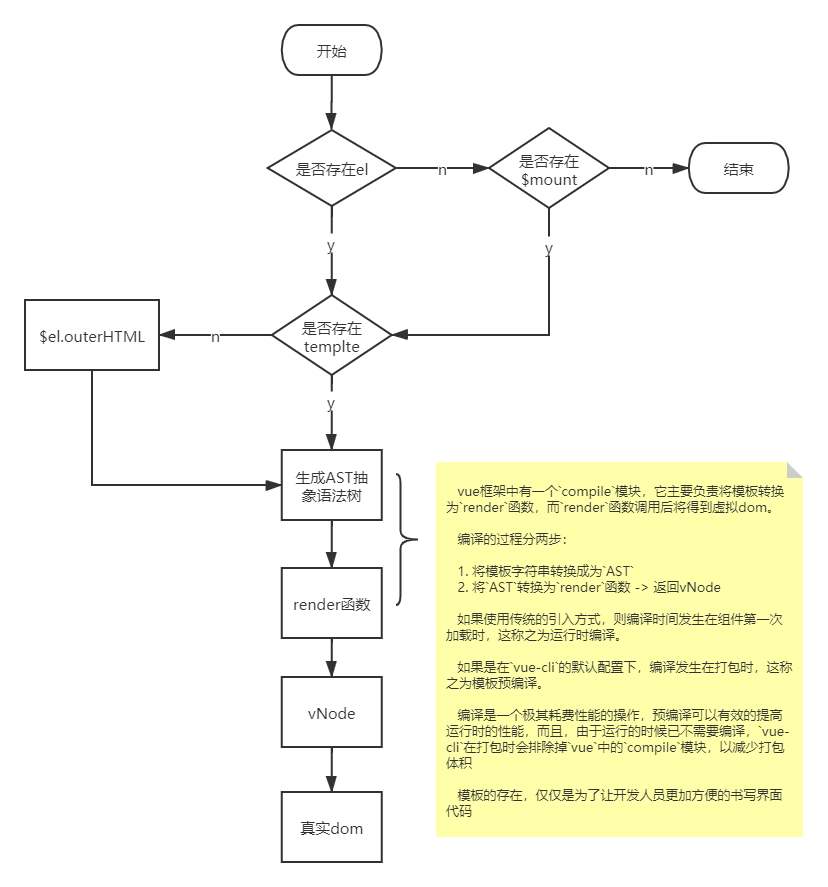

# vue
**Vue最核心的三部分：**
即：compiler、reactivity、runtime。
1. compiler 表示template编译成有规律的数据结构，即AST抽象语法树。
2. reactivity 表示data数据可以被监控，通过proxy语法来实现。
3. runtime 表示运行时相关功能，虚拟DOM(即：VNode)、diff算法、真实DOM操作等。

vue render实现是借鉴snabbdom

**vue渲染流程:**
   
  

**computed、watch、methods 之间的区别**
- methods里面定义的函数，是需要主动调用的，当data里面数据有改变就会调用使用的方法，即使data里面改变的不是我用到的数据也会调用页面中引用的方法
  而和watch和computed相关的函数，会自动调用,完成我们希望完成的作用
  例如：

   ```vue
   <template>
   <div id="app">
      {{perse()}}
   </div>
   </template>
   <script>
   export default {
   data() {
      return {
      a:'a'
      b:'b'
      c:'c'
      };
   },
   methods(){
      perse(){
         return this.a + this.b
      }
   }
   };
   </script>
   vm.$data.c=123
   修改了c 还是会执行 perse

   ```
- watch擅长处理的场景：一个数据影响多个数据
- computed擅长处理的场景：一个数据受多个数据影响

   | \        | 缓存 | 异步 |
   | -------- | ---- | ---- |
   | computed | 是   | 否   |
   | watch    | 否   | 是   |
   | methods  | 否   | 是   |


在beforeCreate执行后 => 初始化（init）injections & reactivity(data、methods、computed、...) =>Created
data、methods、computed 执行顺序 **data** => **methods** => **computed**
```vue
<template>
  <div id="app">
   {{perse}}
  </div>
</template>
<script>
export default {
  data() {
    return {
     perse:'data'
    };
  },
  computed(){
   perse(){
      return 'computed'
   }
  },
  methods(){
     perse(){
        return 'methods'
     }
  }
};
</script>
console.log(perse) => **data** => **methods** => **computed**
```